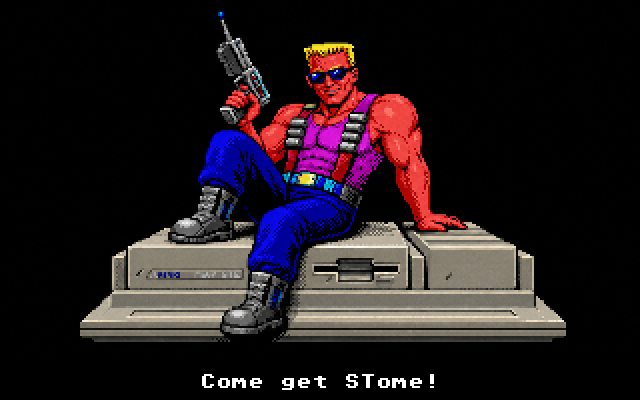

# FreeNukum for Atari ST



Atari ST port of [FreeNukum](https://gitlab.com/silwol/freenukum) by
[Neil Rackett](https://x.com/neilrackett).

## Introduction

To celebrate 35 years of two great 90s icons, Duke Nukem and the Atari Mega STE,
I've ported ~~Duke Nukem~~ FreeNukum to the Atari ST with support for the Mega
STE's Blitter and 16MHz modes.

You can download the latest version from the
[releases page](https://github.com/neilrackett/atarist-freenukum/releases).

## Controls

| Key     | Action                               |
| ------- | ------------------------------------ |
| ← / →   | Walk left / right                    |
| Ctrl    | Jump                                 |
| Alt     | Fire                                 |
| ↑ / ↓   | Use doors, elevators and other items |
| Return  | Select menu item                     |
| Esc / Q | Quit level / back to menu            |
| F1      | Help                                 |

A joystick in port 1 also works: push up to use doors and lifts —
or to jump when there's nothing to use — and fire to shoot.

## System requirements

- Atari ST, STE, Mega ST/STE or TT with **2MB RAM** or more
- Colour monitor or TV (the game runs in ST low resolution)
- A hard disk (or emulated GEMDOS drive) with the game files:
  - `NUKUM.TOS`
  - `NUKUM\DATA\*.DN1` — the original Duke Nukem 1 data files, e.g. from the
    freely available shareware episode (`1duke.zip` / `DN1SW20.SHR`)

## Game data

The game requires the original game graphics and level data, extracted into
the `NUKUM\DATA` folder alongside `NUKUM.TOS`.

The easiest way to install the freely distributable shareware episode is the
bundled installer — run it from the folder containing `NUKUM.TOS`:

- **macOS / Linux:** `sh installer/install.sh`
- **Windows:** `installer\install.bat`

The game data can be obtained:

- Shareware episode from ftp://ftp.3drealms.com/share/1duke.zip (free of
  charge)
- Search on https://archive.org/ for it.
- The Duke Nukem 3D CD contains a copy of the full version.
- Buy it from an online store if you find it. It used to be available on
  [GOG.com](https://www.gog.com/news/release_duke_nukem_12), but that is no
  longer the case. Maybe it will be available some time in the future
  again.

## Building

The easiest way to build the project is using
[atarist-toolkit-docker](https://github.com/sidecartridge/atarist-toolkit-docker)
(`m68k-atari-mint-gcc` via the `stcmd` wrapper):

```sh
stcmd make -f Makefile.atari
```

The executable is built to `dist/NUKUM.TOS`, with no dependencies beyond the
game data files — SDL is replaced by a native ST implementation in
[atari/nsdl](./atari/nsdl).

## Original version

To find more information about the original FreeNukum project, check out the
project page at http://launchpad.net/freenukum or take a look at the
[INSTALL](./INSTALL) file for more information about building it.
